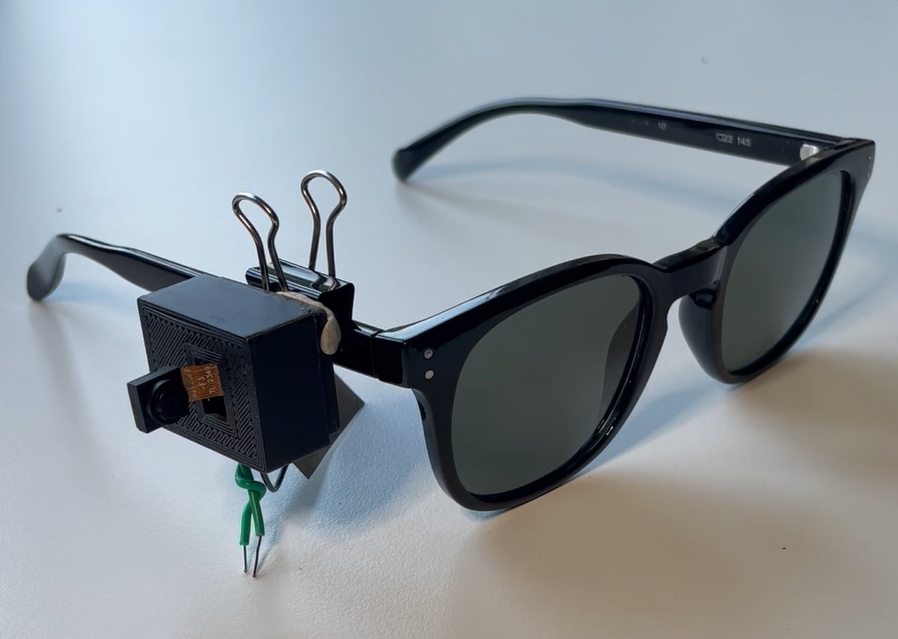
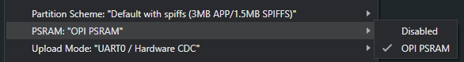

# Voice Assistant Camera Wearable

Improved my previous [ESP32-CAM Semantic Search Wearable](https://github.com/xanderchinxyz/ESP32-CAM-Semantic-Search) by improving the physical design and adding a voice assistant powered by:
- [A local multimodal large language model](https://www.ollama.com/library/moondream)
- [Groq](https://groq.com/) with Retrieval Augmented Generation (RAG)
- [VOSK speech recognition model](https://alphacephei.com/vosk/).

## Video Demo

https://youtube.com/shorts/sPIqjVPMnrE

## Setup and Installation
### Hardware and Components
- 1 XIAO ESP32 S3 Sense board
- 1 [220 mAh LiPo battery](https://www.amazon.ca/dp/B0CKRBTW8Z?psc=1&ref=ppx_yo2ov_dt_b_product_details)
- 1 3-way switch
- 1 [3D Printed Case + Lid](https://github.com/xanderchinxyz/Voice-Assistant-Camera-Wearable/tree/main/STL-Files)
- 2 Wires
- 1 Binder clip attached to the case with some sticky tack to attach for clipping onto a pair of glasses

Solder components like so:
1. One wire connects to D0
2. The other wire connects to GND or BAT- and interlock this wire with the other wire (it helps with registering touch presses)
3. Solder the leftmost prong of the 3-way switch to the BAT+ pin
4. Solder the negative battery wire to the BAT- pin and the positive battery wire to the middle prong of the 3-way switch

### Software
1. Clone the repo with `git clone https://github.com/xanderchinxyz/Voice-Assistant-Camera-Wearable.git`
2. In the root folder install required libraries and dependencies with `pip install requirements.txt`
3. Create a `.env` in the root directory and add your Groq API key by pasting `GROQ_API_KEY="YOUR_API_KEY_HERE"` in the file
4. Install Ollama and download the [moondream2 model](https://www.ollama.com/library/moondream) by running `ollama pull moondream` in a terminal
5. Install the firmware onto the XIAO ESP32 S3 board:
   1. Go to the [firmware folder](https://github.com/xanderchinxyz/Voice-Assistant-Camera-Wearable/tree/main/xiao-firmware) and open the `.ino` file in the Arduino IDE
   2. Follow the software preparation steps to set up the Arduino IDE for the XIAO ESP32S3 board:
      - Add ESP32 board package to your Arduino IDE:
        - Navigate to File > Preferences, and fill "Additional Boards Manager URLs" with the URL: `https://raw.githubusercontent.com/espressif/arduino-esp32/gh-pages/package_esp32_index.json`
        - Navigate to Tools > Board > Boards Manager..., type the keyword `esp32` in the search box, select the latest version of `esp32`, and install it.
      - Select your board and port:
        - On top of the Arduino IDE, select the port (likely to be COM3 or higher).
        - Search for `xiao` in the development board on the left and select `XIAO_ESP32S3`.
   
   3. Before you flash go to the "Tools" drop-down in the Arduino IDE and make sure you set "PSRAM:" to "PSRAM: "OPI PSRAM"
      
      
   4. Upload the firmware to the XIAO ESP32S3 board by putting it in BOOT mode (press the boot button down, then click the reset button, then release the boot button)
6. Run `main.py`
   - Make sure the Ollama server is on by running `ollama serve` in a terminal
   - When first running the script it will probably take a while to download the VOSK model
   - To connect to the device, click on the window popup, press the "Select BLE Device" button, and wait for the device to show up (don't mind the UI 😅)

## How It Works
When the wearable is switched on and the user is connected to the software, the wearable will start taking pictures every 5 seconds which will be sent over via Bluetooth Low Energy (BLE). Once the picture is received it is sent to a multimodal local language model running on Ollama which generates a description of the image. The image is saved to the [Pictures](https://github.com/xanderchinxyz/Voice-Assistant-Camera-Wearable/tree/main/Pictures) folder and the file name and description are added to a vector database and data frame containing past image files and descriptions. If the user presses the wire to ask the wearable a question, the wearable will turn off the camera and start recording audio packets. These audio packets are sent via BLE and processed by VOSK to generate the user transcription query. This transcription query is vectorized to obtain relevant context from the vector database and the question and context are sent to Groq for a super-fast response with an appropriate answer. Once the response is received, a [Text-To-Speech model](https://pypi.org/project/pyttsx3/) reads out the response, and the top 5 most relevant images are displayed on the screen. The user can then ask follow-up questions or press the wire to resume capturing images. When the user closes the software, the image file names and descriptions are saved to `image-descriptions.csv`.

## Acknowledgements
Thank you to [OpenGlass](https://github.com/BasedHardware/OpenGlass) for open-sourcing their code which helped me create the embedded software for the XIAO ESP32 S3.
